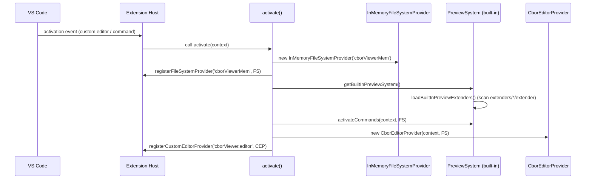
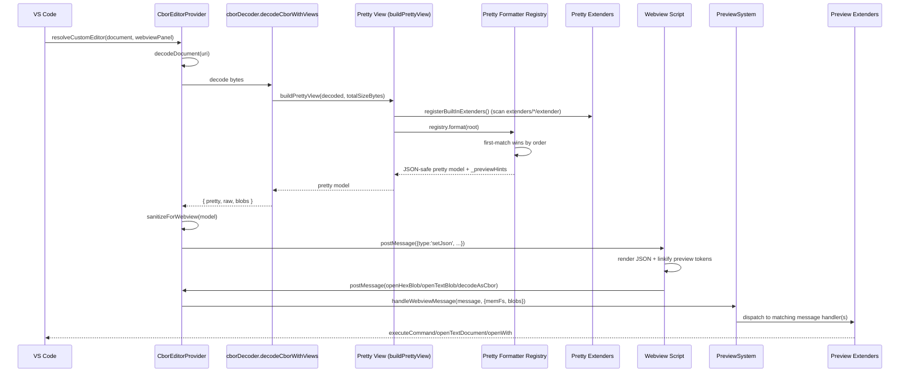

# Architecture Overview

This extension is structured around a **minimal core** plus two **dynamic extender systems**:

1. **Pretty system**: turns decoded CBOR values into a JSON-safe, human-friendly model.
2. **Preview system**: contributes UX actions (commands + webview message handlers) such as “open hex”, “open text”, and “decode as CBOR”.

The intent is that *most* behavior lives in small, independently-owned extenders, not in the core.

---

## Big picture

### Core responsibilities

- Activate the extension and register the custom editor.
- Decode CBOR bytes into (pretty, raw) views.
- Maintain blob storage (bytes) used by the webview for “open hex/text” actions.
- Enforce webview security constraints (CSP, sanitization, message validation).

### Extender responsibilities

- **Pretty extenders**:
  - Add domain/spec-aware formatters (COSE, CWT, SCITT, etc.).
  - Add label registries (known header ids / claim ids).
  - Add preview generators that materialize user-visible preview fields from preview hints.

- **Preview extenders**:
  - Register VS Code commands.
  - Register webview message handlers (open hex blob, open text blob, decode as CBOR, etc.).
  - Register preview-hint kinds that control how the webview linkifies values and which context menu actions are offered.

---

## Activation & registration flow (sequence)

Notes:
- The activation entrypoint must remain as `src/extension.ts` because VS Code loads the compiled `out/extension.js`.
- The *behavior* registered during activation is intentionally delegated to the preview system.

---

## Custom editor open & render flow (sequence)

---

## Webview safety model

Key constraints:

- The model sent to the webview must be **JSON-safe**.
- Internal blob IDs must not be directly exposed in a way that lets the webview request arbitrary blobs.

Mechanism:

- The model contains `_previewHints` describing which fields should be “openable” and which blob id they map to.
- `sanitizeForWebview()` converts those hints into *tokenized strings* suitable for linkification, then strips `_previewHints` and other internal fields.

This keeps the webview rendering logic simple while keeping the core model extensible and safe.

---

## Extension points (summary)

- Pretty:
  - Formatter registry (ordered, first match wins)
  - Label registry contributions
  - Preview generator registry contributions

- Preview:
  - Command registrations
  - Webview message handlers

For step-by-step guides, see:

- `docs/pretty-extenders.md`
- `docs/preview-extenders.md`
- `docs/how-to-extend.md`
