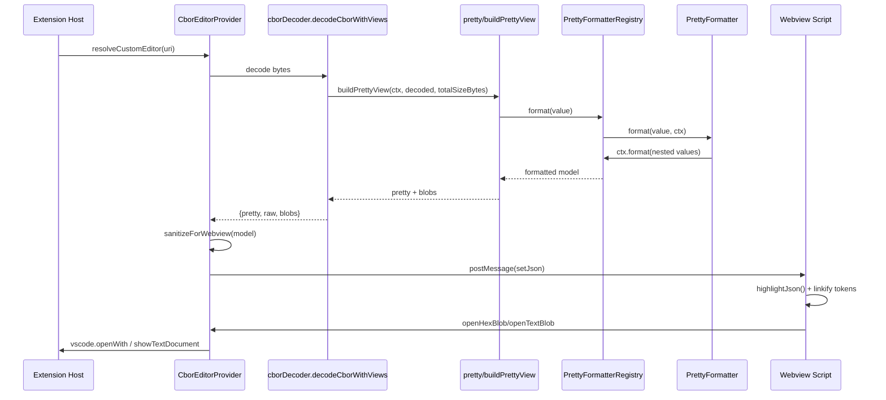

# Pretty-View Architecture (Formatters + Preview Hints)

This extension has two user-facing render modes:

- **Pretty**: safe, recursively expanded output with domain-aware formatters (e.g. COSE_Sign1, CWT) and embedded-CBOR detection.
- **Raw**: lossless-ish structural view (maps as entry arrays, no embedded decoding, no domain-specific interpretation).

This document focuses on **pretty-view extensibility**.

## Goals

- Make prettifying **extremely extensible**: contributors add new formatters without editing large monolithic code.
- Keep the model **JSON-safe** (no `BigInt`, no Buffers) while still supporting byte blobs.
- Provide a first-class **preview hint** system so formatters can declare previewFields (e.g. `hexPreview`, `textPreview`) without embedding webview-specific tokens.

## Key Modules

- `src/pretty/registry.ts`
  - `PrettyFormatter`: the contribution interface.
  - `PrettyFormatterRegistry`: ordered selection (first-match wins).
- `src/pretty/defaultRegistry.ts`
  - Creates an empty registry; built-in extenders register formatters at runtime.
- `src/pretty/prettyView.ts`
  - Orchestrates recursion, depth limits, embedded decode policy.
- `src/pretty/extenders/loadBuiltInExtenders.ts`
  - Discovers and registers built-in extenders by scanning `src/pretty/extenders/<dir>/extender`.
- `src/pretty/bytesPreview.ts`
  - Central place for bytes previews + blob registration + preview hints.
- `src/cborEditorProvider.ts`
  - `sanitizeForWebview()` consumes preview hints and injects webview link tokens.

## Data Flow (Sequence Diagram)



## Preview Hints

The **model** can carry `previewFields` like `hexPreview` and `textPreview` as normal strings.

To make them clickable in the webview, the model can also include a `_previewHints` map:

```ts
{
  _previewHints: {
    hexPreview: { kind: 'hex',  blobId: 'blob-1' },
    textPreview:{ kind: 'text', blobId: 'blob-1' }
  }
}
```

- Formatters should **not** inject token prefixes.
- `sanitizeForWebview()` applies the tokens and removes internal fields (`_hexBlobId`, `_previewHints`).

## Adding a New Pretty Formatter (Flow)

```mermaid
flowchart TD
  A[Pick a CBOR shape to prettify] --> B[Implement PrettyFormatter]
  B --> C[canFormat(): match tag/label/shape]
  C --> D[format(): build JSON-safe output]
  D --> E[Use ctx.format() for nested values]
  E --> F[Optionally add _previewHints]
  F --> G[Export prettyExtender.register()]
  G --> H[Loader discovers extender at runtime]
  G --> H[Add/extend unit tests]
```

## Contributor Checklist

- Keep formatters small and composable; prefer adding a new formatter over editing existing ones.
- Always return JSON-safe values:
  - Convert `BigInt` to string.
  - Convert byte strings to `BytesPreview` via `createBytesPreview()`.
- Use preview hints instead of webview tokens.
- Add unit tests in `src/test/unit` to lock in behavior.
