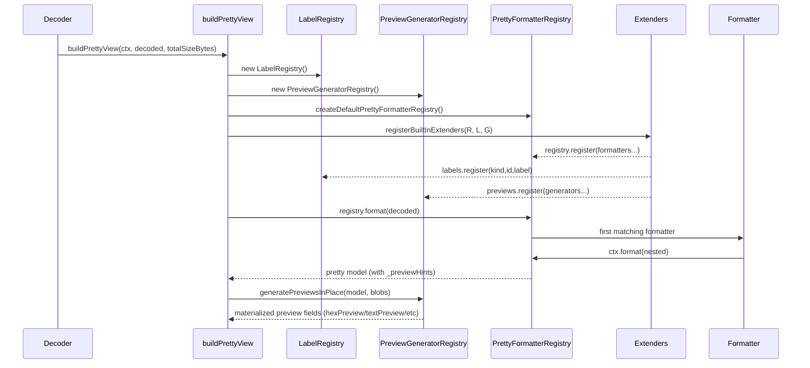

# Pretty Extenders: Formatters, Labels, and Preview Generators

The **pretty system** is responsible for converting decoded CBOR values into a JSON-safe, human-friendly representation.

It is designed around an **ordered registry** plus **dynamic extender discovery**.

---

## Mental model

- **Pretty view** is a pure transformation: decoded CBOR → JSON-safe model.
- Formatters run in **order** (lowest first). The first formatter whose `canFormat()` matches wins.
- Extenders provide **three independent contributions**:
  1. Formatters
  2. Label registrations
  3. Preview generators

---

## Data flow (sequence)



---

## Extension points

### 1) Add a formatter

A formatter is a small unit that:

- **Recognizes** a value shape (`canFormat`).
- **Produces** JSON-safe output (`format`).
- Delegates recursion to `ctx.format()`.

Formatter interface:

- Location: `src/pretty/registry.ts`
- Key properties:
  - `id`: stable identifier
  - `order`: lower runs earlier
  - `canFormat(value, ctx)`
  - `format(value, ctx)`

Important: **Do not** inject webview-specific tokens in string values.

### 2) Register labels

Labels are a lightweight extension point to name well-known numeric ids.

- COSE header labels: kind `coseHeader`
- CWT claim labels: kind `cwtClaim`

Labels are used by formatters via `ctx.labels.getCoseHeaderName(...)` and `ctx.labels.getCwtClaimName(...)`.

### 3) Register preview generators

The model may contain `_previewHints` describing which fields should exist (e.g. `hexPreview`, `textPreview`) and how they map to blob ids.

Preview generators:

- Take `(kind, hint, value, ctx)`
- Return the preview string for that field (or `undefined`)
- Are registered per model `_type`

A typical bytes preview pipeline:

- `createBytesPreview()` returns:
  - `_hexBlobId`
  - `_previewHints: { hexPreview: {kind:'hex', blobId}, textPreview: {kind:'text', blobId} }`
- `PreviewGeneratorRegistry.generatePreviewsInPlace(...)` computes `hexPreview` and `textPreview` strings.

---

## How to add a new pretty extender (step-by-step)

### Step 1: Create a new extender folder

Create a new directory:

- `src/pretty/extenders/<yourExtenderName>/`

Add `extender.ts` inside that folder. The loader scans `src/pretty/extenders/*/extender` at runtime.

### Step 2: Export `prettyExtender`

Your module must export `prettyExtender`:

```ts
import type { PrettyExtender } from '../prettyExtender';

export const prettyExtender: PrettyExtender = {
  id: 'my-feature',
  register(registry, labels, previews): void {
    // registry.register(...)
    // labels.register(...)
    // previews.register(...)
  }
};
```

### Step 3: Implement and register your formatter

```ts
import type { PrettyFormatter, PrettyFormatterContext } from '../../registry';

export const MyFormatter: PrettyFormatter = {
  id: 'my-formatter',
  order: 200,
  canFormat(value: unknown): boolean {
    return !!value && typeof value === 'object' && (value as any)._type === 'my-type';
  },
  format(value: unknown, ctx: PrettyFormatterContext): unknown {
    const v = value as any;
    return {
      _type: 'my-type',
      nested: ctx.format(v.nested, ctx.depth + 1)
    };
  }
};
```

Then register it:

```ts
registry.register(MyFormatter);
```

### Step 4: Add labels (optional)

```ts
labels.register('coseHeader', 1234, 'my-header');
```

### Step 5: Add preview generation (optional)

If your model returns `_previewHints`, register a `PreviewGenerator` for that model `_type`.

---

## Testing a pretty extender

Unit tests live under:

- `src/test/unit/*.unit.test.ts`

Recommended patterns:

- Add a fixture CBOR blob in `test/fixtures/` when realism matters.
- Otherwise, build small CBOR values using `cbor.encodeOne(...)`.
- Assert the pretty view includes:
  - Your fields
  - Proper recursion
  - JSON-safe output
  - Correct labels

Run:

- `npm run test:unit`
- `npm run test:coverage`

---

## Practical rules (don’t skip)

- Keep formatters small; add new formatters rather than expanding monoliths.
- Never return `Buffer` or `BigInt` in the model.
- Treat embedded CBOR decode as best-effort: do not throw on decode failure.
- Use `_previewHints` + generators; do not insert webview tokens directly.
