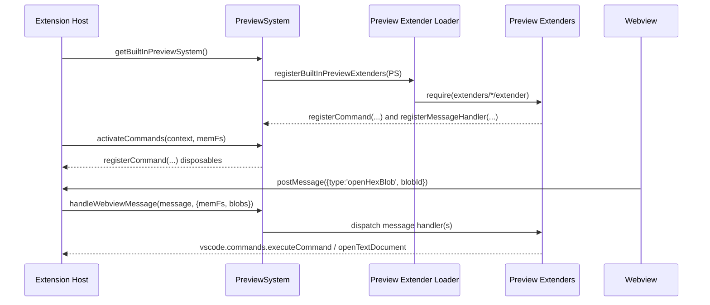

# Preview Extenders: Commands and Webview Actions

The **preview system** is responsible for user-triggered actions:

- VS Code commands (command palette / menus)
- Webview message handlers (clicking preview links, context menu actions)

Preview behavior is contributed via **dynamic extenders** located under:

- `src/preview/extenders/<name>/extender.ts`

---

## Data flow (sequence)



---

## Preview extender interface

- Location: `src/preview/extenders/previewExtender.ts`

Each extender exports `previewExtender`:

```ts
import type { PreviewExtender } from '../previewExtender';

export const previewExtender: PreviewExtender = {
  id: 'my-preview-ext',
  register(system): void {
    // system.registerCommand(...)
    // system.registerMessageHandler(...)
  }
};
```

---

## Extension points

### 1) Register a VS Code command

Commands are registered via `system.registerCommand(...)`.

Typical pattern:

```ts
system.registerCommand(({ memFs }) => {
  const vscode = PreviewSystem.vscode();
  return vscode.commands.registerCommand('my.command', async () => {
    // ... use memFs as needed
  });
});
```

Notes:
- `PreviewSystem.vscode()` is a lazy accessor so unit tests can swap VS Code mocks.
- Return a `Disposable` from the registration.

### 2) Register a webview message handler

Message handlers are registered by `type`:

```ts
system.registerMessageHandler('openHexBlob', async (message, ctx) => {
  // ctx.memFs, ctx.blobs
  return true; // handled
});
```

Conventions:
- Return `true` if the message type was recognized (even if it was a no-op due to missing data).
- Return `false` only when the handler does not apply to the given message shape.
- Do strict input validation (`typeof message.blobId === 'string'`, etc.).

---

## Built-in preview extenders (high level)

This repo ships several built-in extenders under `src/preview/extenders/`:

- `openHexBlob` / `openTextBlob`: open a referenced blob in the Hex Editor or as a text document.
- `decodeAsCbor`: decode a blob/string selection as CBOR and open it in the viewer.
- `decodeAsCoseHeaders`: decode a blob as CBOR and force COSE header-map formatting (explicit user intent).
- `decodeSelectionCommand` / `openHexCommand`: command palette / editor context command helpers.
- `previewHintKinds`: registers the hint kinds (tokens + CSS class + context menu templates) consumed by the webview.

---

## How to add a new preview extender (step-by-step)

### Step 1: Create extender folder

Create:

- `src/preview/extenders/<yourName>/extender.ts`

The loader scans `src/preview/extenders/*/extender` at runtime.

### Step 2: Register a command or handler

Example: add a new message handler that opens a blob as base64 text:

```ts
system.registerMessageHandler('openBase64Blob', async (message, ctx) => {
  const blobId = typeof message.blobId === 'string' ? message.blobId : undefined;
  if (!blobId) return true;

  const bytes = ctx.blobs.get(blobId);
  if (!bytes) return true;

  const vscode = PreviewSystem.vscode();
  const base64 = Buffer.from(bytes).toString('base64');
  const memUri = ctx.memFs.createUri(`${blobId}.b64.txt`, Buffer.from(base64, 'utf8'));
  const doc = await vscode.workspace.openTextDocument(memUri);
  await vscode.window.showTextDocument(doc, { preview: true });
  return true;
});
```

### Step 3: Wire the webview UI (if needed)

If the action is invoked from the webview, add a link token / context-menu action in the webview script.

(Keep this minimal: the preferred pattern is to reuse existing tokenization and message dispatch.)

---

## Testing preview extenders

Preview extenders should be covered by unit tests.

Patterns used in this repo:

- Use `mock-require` to provide a VS Code mock.
- Use `createVscodeMock()` from `src/test/unit/vscodeMock.ts`.
- Build an in-memory FS provider and a `PreviewSystem` instance.
- Register your extender, then:
  - Call the registered command handler, or
  - Call `PreviewSystem.handleWebviewMessage(...)` with a fake message.

Run:

- `npm run test:unit`
- `npm run test:coverage`
